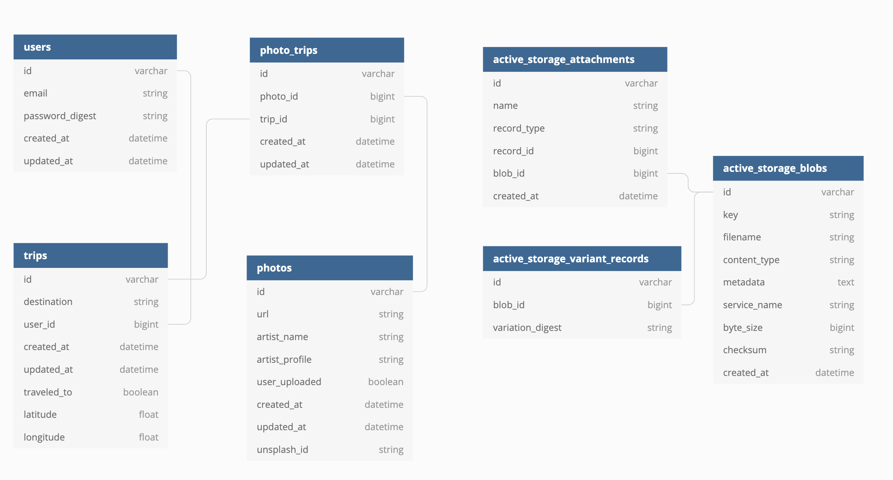

<br>

   

This GraphQL on Rails API ([deployed endpoint](https://photo-repo-api.herokuapp.com/graphql)) serves queries and mutations for Virtual Escape, an application that allows you to travel in covid-safe style from your couch (or, let's be real, bed). There's a whole world out there so put on your best sweats and come TFH (travel from home)!

#### What can I do on Virtual Escape?
  - Search for a destination and see matching photos
  - Create trips (these could be places that you've been to or have yet to visit)
  - Add photos to your trip
    - upload a file
    - or save from your search results
  - View stats like top saved destinations

*I created this API for my application to Shopify's Backend Engineering Internship program.  This is an API only (no user interface) but I plan to build out a React frontend for Virtual Escape.*

#### Stack
- Ruby on Rails, GraphQL, RSpec, Travis-CI, Heroku, Cloudinary, PostgreSQL
- Some of the gems that I found most useful: 
    - pry, factory bot, faker, shoulda matchers, simplecov, vcr, webmock

# Readme Content
- [Approaching the Challenge](#approaching-the-challenge)
- [Local Setup](#local-setup)
- [External APIs](#external-apis)
- [Test Suite](#test-suite)
- [GraphQL Schema](#graphql-schema)
- [Database Schema](#database-schema)
- [Project Tracking](#project-tracking)
- [Contributor](#contributor)

# Approaching the Challenge
The [task](https://docs.google.com/document/d/1ZKRywXQLZWOqVOHC4JkF3LqdpO3Llpfk_CkZPR8bjak/edit): build an image repository
  - Features that meet this requirement: 
      - Upload photos (using Active Storage)
      - Save an Unsplash photo's URL
      - Search images by location (pulls from Unsplash)

I could have created a monolith app without the need for a separate front-end but I thought that displaying my API development skills would be more relevant to a backend engineering position. 

I consumed 2 RESTful APIs and exposed a GraphQL endpoint with several queries and mutations. For file upload I utilized Active Storage and am using [Cloudinary](https://cloudinary.com/) for image hosting.

# Local Setup
- Versions
  - Rails 6.1.0
  - Ruby 2.5.3
- Fork and clone the repository
- `cd` in your local repo version and run the following commands
  - To install gems:
    -  `bundle` (if this fails, try to `bundle update` and then retry)
  - This API uses a few [external APIs](#external-apis)
    - Add a local application.yml file at the root (this will be ignored in gitcoverage)
    - Get API keys for the [Unsplash](https://unsplash.com/join) and [Mapquest](https://developer.mapquest.com/plan_purchase/steps/business_edition/business_edition_free/register) API and add to your application.yml config: 
    ```
    PHOTOS_API_KEY: your_key_here
    GEOLOCATION_API_KEY: your_key_here
    ```
  - To setup database:
    - `rails db:create`
    - `rails db:migrate`
    - `rails db:seed`
- Run your own development server:
  - `rails s`
  - You should be able to access the GraphQL interface and see available queries and mutations via the docs on [http://localhost:3000/graphiql](http://localhost:3000/graphiql)

# External APIs
This API consumes the following APIs:
- [Unsplash Search Photos API](https://unsplash.com/documentation#search-photos) to search for images at a destination
  - Requirements for use: [properly provide attribution for the photographer and Unsplash](https://help.unsplash.com/en/articles/2511315-guideline-attribution)
- [MapQuest Geocoding API](https://developer.mapquest.com/documentation/geocoding-api/) to assign latitude and longitude to a trip's location

# Test Suite
- Run with `bundle exec rspec`
- All tests should be passing
- 97% test coverage

# GraphQL Schema
Endpoint (direct your POST requests here): https://photo-repo-api.herokuapp.com/graphql

### Resource Queries
#### Photos
  - **Search Photos**: 10 photos that match a search term
    - Type: [Photo](#photo)
    - Arguments: 
        ```
          argument :keyword, String, required: true
        ```
  - **Get Photos**: all photos (user uploaded as well as those saved from Unsplash)
    - Type: [Photo](#photo)
    - Arguments: none

#### Users
  - **Get User**: user by ID
    - Type: [User](#user)
    - Arguments: 
        ```
          argument :id, ID, required: true
        ```
  - **Get Users**: all users
    - Type: [User](#user)
    - Arguments: none

#### Trips 
  - **Get Trip**: get a trip by ID
    - Type: [Trip](#trip)
    - Arguments: 
        ```
          argument :id, ID, required: true
        ```

### Analytics Queries
  - **Top Destinations**: top trip destinations, ranked highest to lowest
    - Type: [destination](#destination)
    - Arguments: 
        ```
          argument :limit, Integer, required: false
        ```

### Mutations
#### Photos
  - **Add Photo To Trip**: add Unsplash photo to trip (saves to database and creates new photo_trip record)
    - Type: [Photo](#photo)
    - Arguments: 
        ```
          argument :trip_id, ID, required: true
          argument :url, String, required: true
          argument :artist_name, String, required: true
          argument :artist_profile, String, required: true
          argument :unsplash_id, String, required: true
        ```
  - **Add User Photo To Trip**: upload user photo to trip (saves to database, uploads image to Cloudinary, and creates new photo_trip record)
    - Type: [Photo](#photo)
    - Arguments: 
        ```
          argument :trip_id, ID, required: true
          argument :user_photo, ApolloUploadServer::Upload, required: false
        ```

#### Trips
  - **Create Trip**: create a new trip and have its coordinates automatically assigned
    - Type: [Trip](#trip)
    - Arguments: 
        ```
          argument :user_id, ID, required: true
          argument :destination, String, required: false
          argument :traveled_to, Boolean, required: false
        ```
  - **Update Trip**: update existing trip
    - Type: [Trip](#trip)
    - Arguments: 
        ```
          argument :id, ID, required: true
          argument :destination, String, required: false
          argument :traveled_to, Boolean, required: false
        ```

### Types
- ##### Destination
    ```
      field :destination, String, null: false
      field :num_saved_trips, Integer, null: false
    ```
- ##### Photo
    ```
      field :id, ID, null: false
      field :description, String, null: true
      field :url, String, null: true
      field :artist_name, String, null: true
      field :artist_profile, String, null: true
      field :unsplash_id, String, null: true
      field :user_uploaded, Boolean, null: false
      field :user_photo_url, String, null: true
    ```
- ##### User
    ```
      field :id, ID, null: false
      field :email, String, null: false
      field :photos, [Types::PhotoType], null: false
      field :trips, [Types::TripType], null: false
    ```
- ##### Trip
    ```
      field :id, ID, null: false
      field :user_id, ID, null: false
      field :destination, String, null: true
      field :traveled_to, Boolean, null: false
      field :photos, [Types::PhotoType], null: false
      field :latitude, Float, null: true
      field :longitude, Float, null: true
    ```

# Database Schema
<br>

# Project Tracking
**[GitHub project](https://github.com/leahriffell/photo_repo_api/projects/1)**
  - I used branching and pull requests to maintain clean version control

Next top priorities:
  - User authentication with Firebase or Auth0 ([#16](https://github.com/leahriffell/photo_repo_api/issues/16))
  - Secure requests by requiring an API key ([#75](https://github.com/leahriffell/virtual_escape_api/issues/75))
  - Research and implement testing of file uploading to avoid having to locally test in Altair ([#66](https://github.com/leahriffell/photo_repo_api/issues/66))
  - Add edit and delete photo functionality ([#22](https://github.com/leahriffell/photo_repo_api/issues/22), [#40](https://github.com/leahriffell/photo_repo_api/issues/40))
  - More insight queries like most saved photo, trending destinations, etc. ([#55](https://github.com/leahriffell/photo_repo_api/issues/55), [#53](https://github.com/leahriffell/photo_repo_api/issues/53), [#54](https://github.com/leahriffell/photo_repo_api/issues/54))


# Contributor
- Leah Riffell |  [Github](https://github.com/leahriffell)  |  [LinkedIn](https://www.linkedin.com/in/leah-riffell/)

